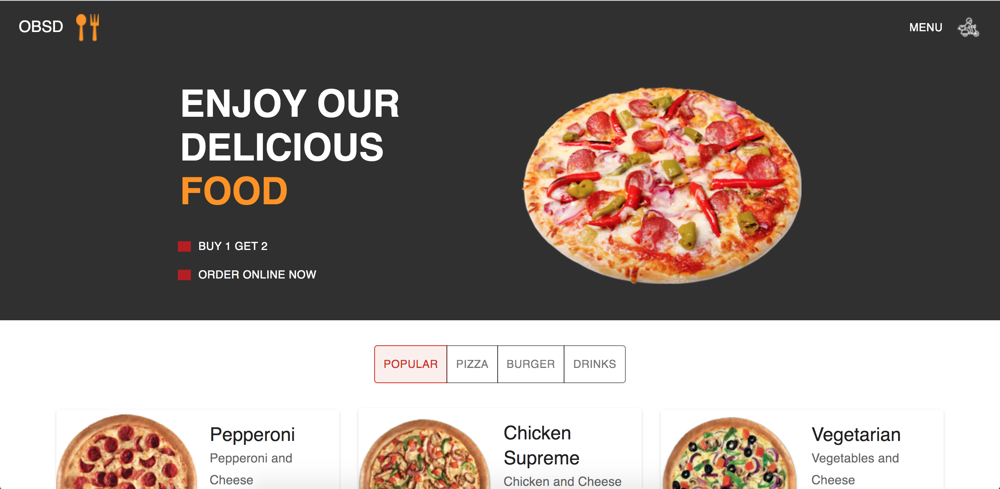
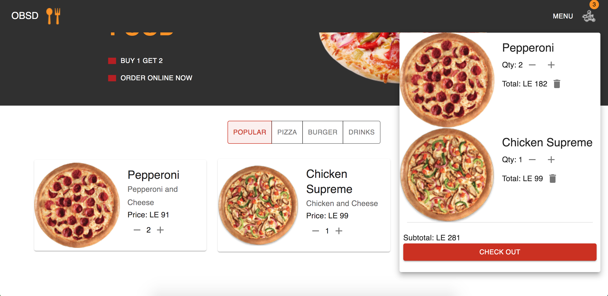

# Pizza APP

This project is a pizza delivery website with the aim of collecting the visitors orders and required information for delivery and displaying a dashboard for the ketchen to keep track of orders and how much time has passed.

## UI:

### Front Page: 

### Checkout Page:

### Order Placed Page:

### Dashboard Page:

## Features:

- Filtering Menu Items
- Cart Tracking Increase/Decrease/Delete
- Collecting Client Information
- Dashboard Displaying Pending/Complete Orders

## Technologies Used

- React JS
- React Reducer
- Material UI
- Formik
- Yup
- Node js
- Express
- Postgresql
- Supabase.

## [Backend Repo](https://github.com/SeifMohy/pizza-app-backend)
